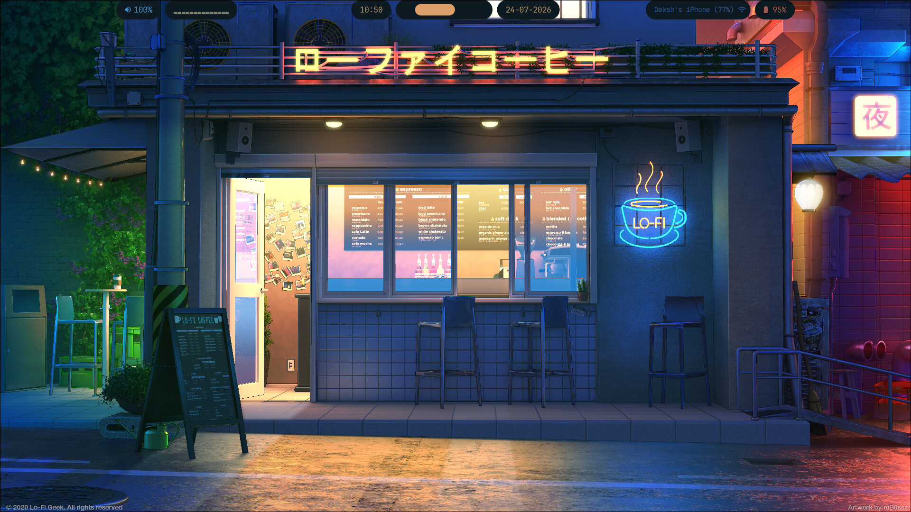
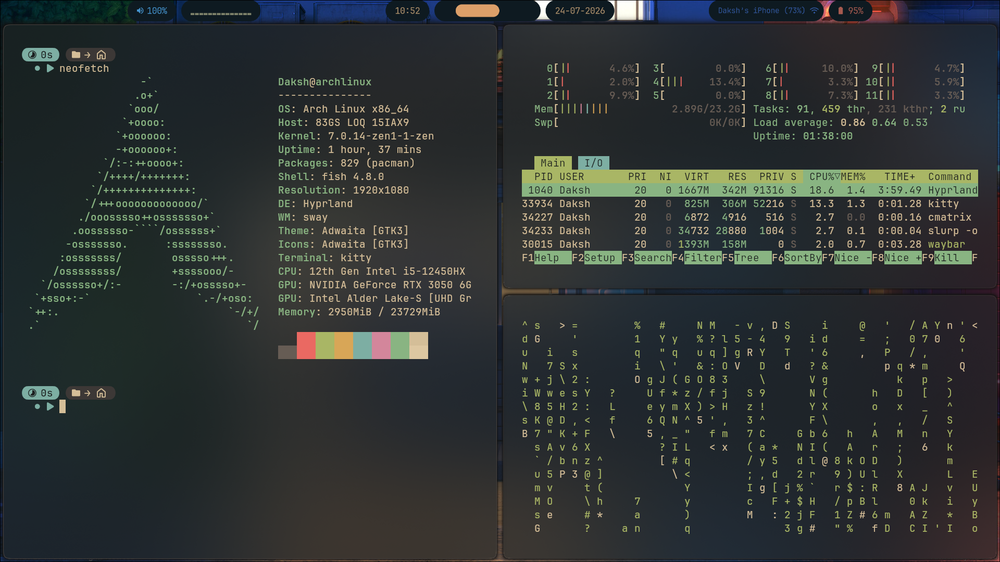
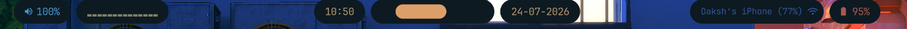
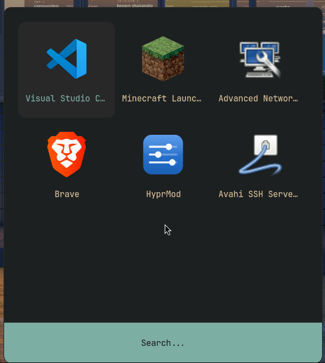
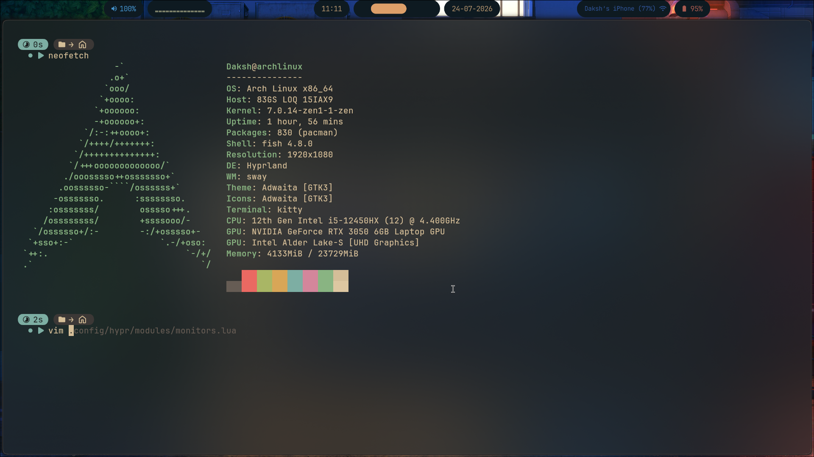
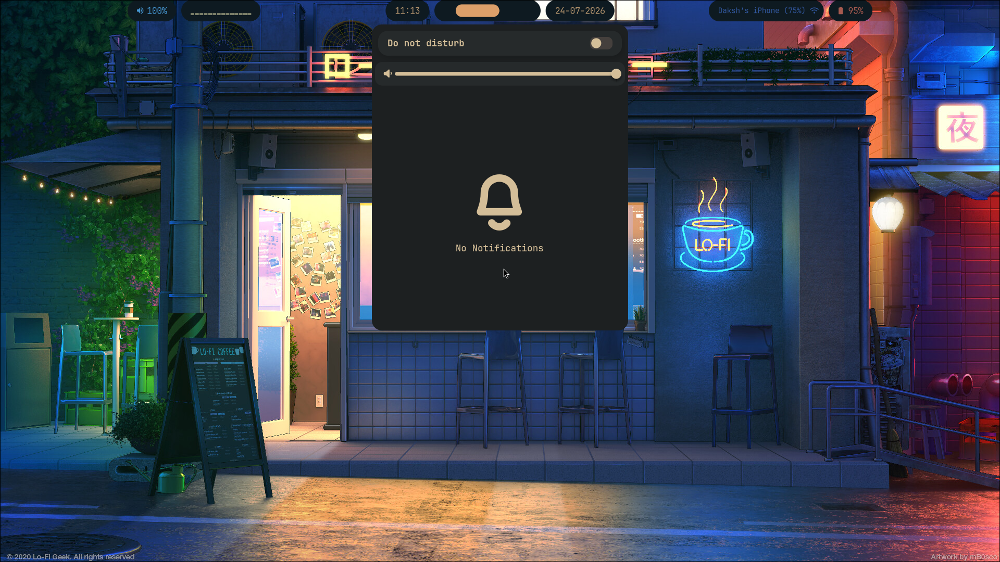
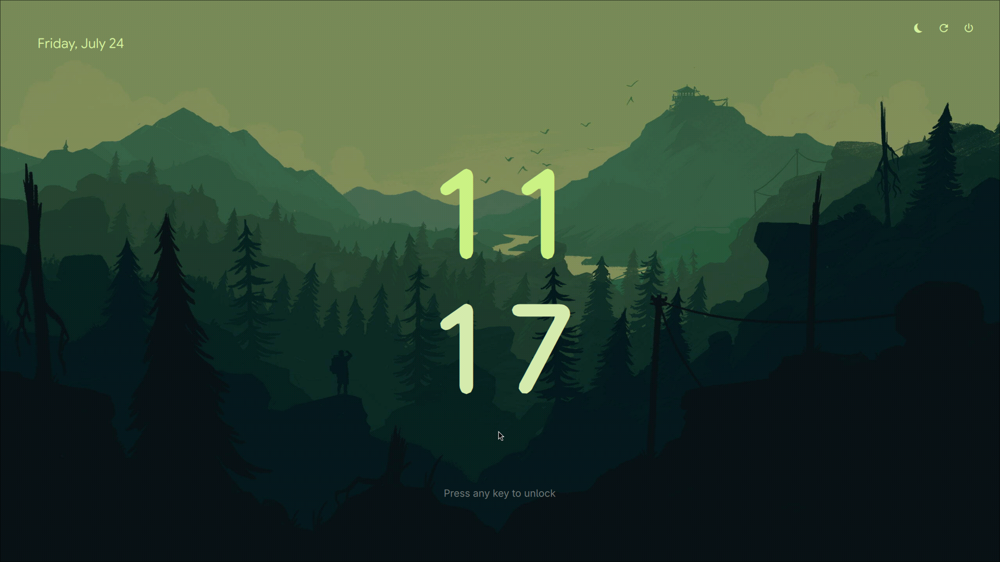

# HyprlandSetup

A personal Arch Linux Hyprland setup with dotfiles, theming, and a few helper scripts. The repository contains the desktop environment configuration, app-specific settings, and a package list for getting the whole experience up quickly.



## Repo layout

- `.config/` contains the main desktop configs for Hyprland, Waybar, Rofi, Kitty, SwayNC, and more.
- `.local/bin/` contains helper scripts used by keybindings and theming actions.
- `etc/` and `usr/` contain system-level configuration files and SDDM theme assets that should be installed into the real `/etc` and `/usr` directories on the machine.
- `essentials` is the package list used for this setup.

## Quick setup

1. Install the packages from the essentials list:

```bash
yay -S --needed $(cat essentials)
```

2. Copy the dotfiles and shell config into place:

```bash
mkdir -p ~/.config ~/.local
cp -r .config/. ~/.config/
cp -r .local/. ~/.local/
cp .vimrc ~/.vimrc
```

3. Install the system-level config files:

```bash
sudo cp -r etc/* /etc/
sudo cp -r usr/* /usr/
```

4. Install the Vim plugin used for the color scheme:

```bash
curl -fLo ~/.vim/autoload/plug.vim --create-dirs https://raw.githubusercontent.com/junegunn/vim-plug/master/plug.vim

vim +PlugInstall +qall
```

> I recommend also installing `gvim` to get system clipboard access in vim `sudo pacman -S gvim`.

5. Reboot or start Hyprland and the relevant services.

---

## What is included

### Hyprland

Hyprland is the window manager for this setup. The main configuration is driven by the HyprMod-style Lua setup in `.config/hypr/`.

- Main entry: `.config/hypr/hyprland.lua`
- Keybindings: `.config/hypr/modules/keybinds.lua`
- Autostart: `.config/hypr/modules/autostart.lua`
- Environment variables: `.config/hypr/modules/env.lua`

Quick setup:
- Install `hyprland` and `hyprmod` from `essentials`.
- Copy `.config/hypr/` into `~/.config/hypr/`.



### Waybar

Waybar provides the top status bar with workspaces, clock, network, sound, and battery information.

- Config: `.config/waybar/config.jsonc`
- Styling: `.config/waybar/style.css`
- Launch script: `.config/waybar/scripts/`

Quick setup:
- Install `waybar-cava-git` and `cava` from `essentials`.
- Copy `.config/waybar/` into `~/.config/waybar/`.



### Rofi

Rofi is used as the application launcher and menu surface.

- Launcher script: `.config/rofi/type-2/launcher.sh`
- Theme files: `.config/rofi/type-2/`

Quick setup:
- Install `rofi` from `essentials`.
- Copy `.config/rofi/` into `~/.config/rofi/`.



### Kitty

Kitty is the terminal emulator used throughout the setup.

- Config: `.config/kitty/kitty.conf`
- Color palette: `.config/kitty/colours/`

Quick setup:
- Install `kitty` from `essentials`.
- Copy `.config/kitty/` into `~/.config/kitty/`.



### Sway Notification Center

SwayNC provides the notification UI and the notification daemon used by the desktop.

- Config: `.config/swaync/config.json`
- Styling: `.config/swaync/style.css`
- Scripts: `.config/swaync/scripts/`

Quick setup:
- Install `swaync` from `essentials`.
- Copy `.config/swaync/` into `~/.config/swaync/`.



### SDDM and the Pixie theme

The login manager uses the Pixie SDDM theme, with the theme files installed under `/usr/share/sddm/themes/pixie/` and the selected theme configured in `/etc/sddm.conf.d/theme.conf`.

- Theme files: `usr/share/sddm/themes/pixie/`
- Theme selection: `etc/sddm.conf.d/theme.conf`

Quick setup:
- Install `sddm` and `pixie-sddm-git` from `essentials`.
- Copy the contents of `usr/` to `/usr/` and the contents of `etc/` to `/etc/`.



### Fish shell

Fish is the default shell in this setup. The main shell config is in `.config/fish/config.fish` and it enables Starship, adds `~/.local/bin` to the path, and sets the Qt theme for compatibility.

- Config: `.config/fish/config.fish`

Quick setup:
- Install `fish` from `essentials`.
- Copy `.config/fish/` into `~/.config/fish/`.

### Starship prompt

Starship provides the custom prompt shown in the terminal. The prompt styling and modules are defined in `.config/starship.toml`.

- Config: `.config/starship.toml`

Quick setup:
- Install `starship` from the package manager if needed.
- Copy `.config/starship.toml` to `~/.config/starship.toml`.

### Vim, Pywal, and wal.vim

The Vim setup uses the `wal.vim` plugin and applies the current Pywal color scheme. The config lives at `.vimrc` at the repository root, and it should be installed as `~/.vimrc` on the machine.

- Config: `.vimrc`
- Plugin: `wal.vim`

Quick setup:
- Install the plugin manager and run `:PlugInstall` in Vim.
- The wallpaper switcher updates the Pywal cache, so the terminal and Vim colors stay in sync after changing the wallpaper.

### Wallpaper switcher and theming

The wallpaper switcher is the centerpiece of the theming flow. It uses Pywal to generate colors from an image, updates Waybar styling, refreshes SwayNC, and optionally plays ambient audio tied to the selected wallpaper.

- Launcher: `.local/bin/walset.sh`
- Backend: `.local/bin/walset-backend.sh`
- Audio toggle: `.local/bin/walset-audio-toggle.sh`
- Rofi theme: `.config/rofi/type-2/style-walset.rasi`

Quick setup:
- Install `python-pywal16`, `matugen-bin`, `mpv`, `awww`, `rofi`, and the related desktop components from `essentials`.
- Place the scripts in `~/.local/bin/` and make sure `~/Pictures/Wallpapers` exists for the wallpaper picker to work.

---

## Notes

- The files inside `usr/` and `etc/` must be placed into the real system directories, not into your home folder.
- Some scripts in `.local/bin/` are referenced by keybindings and notification actions, so keeping that folder in place is important.
- The wallpaper switching helper is located in `.local/bin/walset.sh` and expects wallpapers in `~/Pictures/Wallpapers`.

